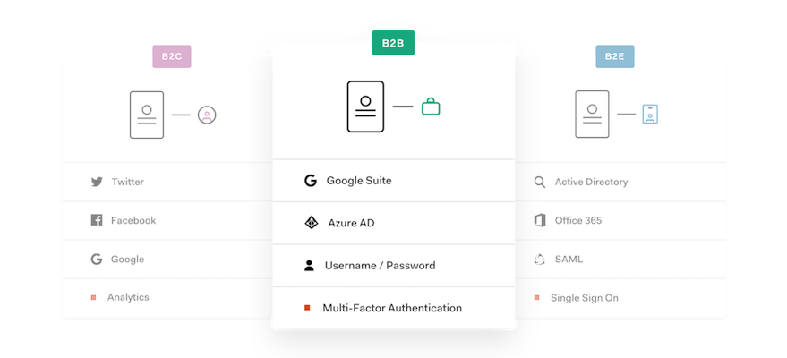
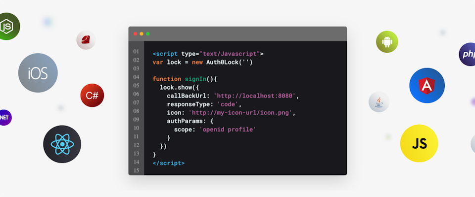
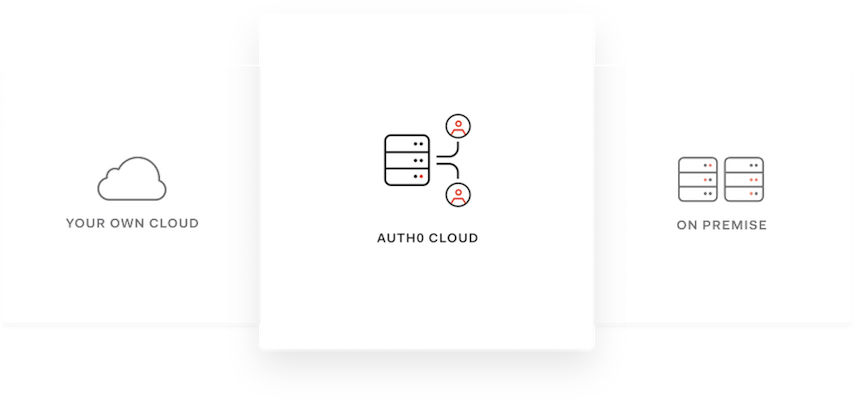
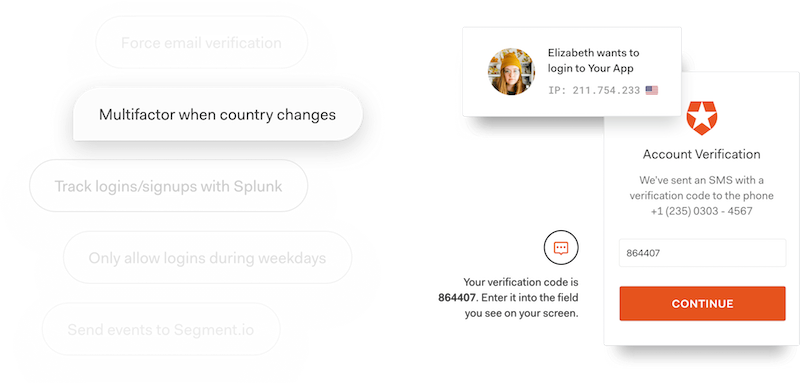
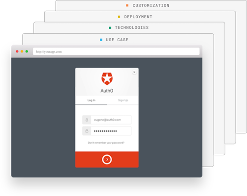
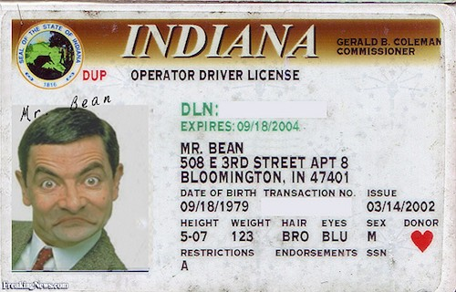
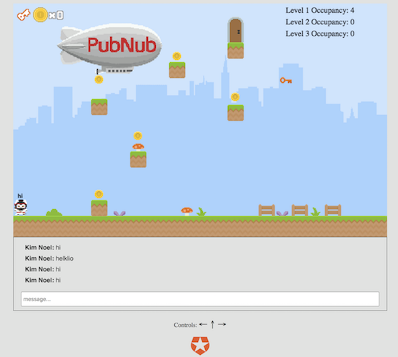

## Intro to Modern Identity
#### Jeremy Meiss

---
### Who is Auth0?

A universal authentication & authorization platform for web, mobile, and legacy applications.

Note:
We provide a universal authentication & authorization platform for web, mobile, and legacy applications.

---
### What is Auth0?

Note:
Choose your use case. Auth0’s Universal Identity Platform for web, mobile and IoT can handle any of them — B2C, B2B, B2E, or a combination.

---
### What is Auth0?

Note:
Your language. Your stack. Auth0 can connect to any application or API. Our 65 + SDKs and pre - configured Quickstarts offer rapid integration.

---
### What is Auth0?

Note:
Choose the deployment that suits your needs — your cloud, Auth0 Cloud, on-premise, or hybrid.

---
### What is Auth0?

Note:
Easily customize your app’s authentication process by writing code or picking one of our 100+ pre-built Auth0 Rules and Extensions.

---
### What is Auth0?

Note:
Your use case(s) + Your tech stack + Your deployment model + Your customization + Your changing needs = a seamless and secure Auth0 Identity solution that adapts to your future.

---
## What is Identity?

Note:
Something tells me that this guy needs some digital identity assistance... Digital identity is at the core of any application - invisible yet crucial. We often take identity for granted as most of its magic happens behind the scenes. But identity plays a much larger role beyond just at the login screen for your applications.

---
## What is **Modern** Identity?

@ul[brighten]
* Authentication @note[Authentication dictates the way users login to your app - which used to be as simple as a uid/pwd. Who here remembers not really having any requirements for a uid/pwd? Now, and justifiably so, it's a lot more complicated. We've added social connections (Twitter/FB/etc) to the mix, along with federation and SSO, and even "passwordless" - but implementing all of these can be a time-consuming, and even a scary proposition given the high stakes. ]
* Authorization @note[Authorization sets in place the rights that someone has, from regular user to Admin. Depending on what is being done inside your app, rules and hooks can interact to make sure users have the right access at the right time. ]
* Security @note[With authentication there's a need to store credentials in the db for future comparisons, and so Security deals with protecting data while it's in motion and at rest. To do so requires proper procedures like hashing, salting, MFA (something you know/have/are), cryptography, brute-force detection, and more. ]
* Personalization @note[When it comes to appealing to customers, slowly but surely, personalization has become the name of the game. IAM can help you understand your users and make smarter, more personalized choices about how you engage them.]
@ulend

Note:
At a high level, we can break up identity into four distinct components: authentication, authorization, user profile, and security. 

---
## Demo Time!

---
## Thank You!

### Questions?
